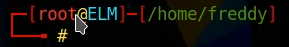
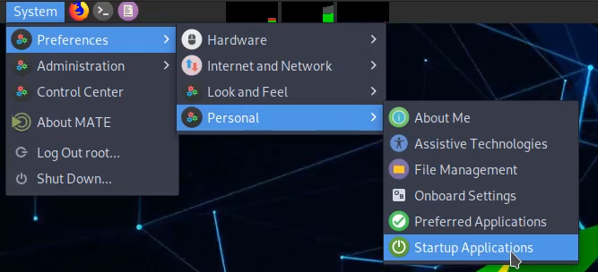
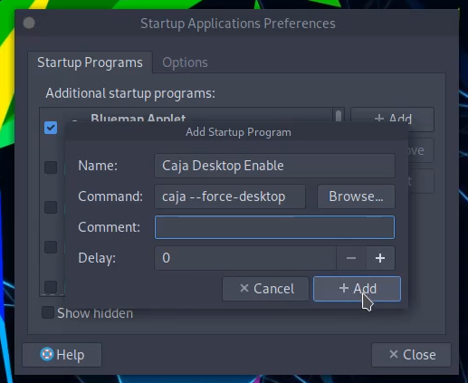

## Switch to root user

```
sudo passwd root 
```
The root user of give new password.

```
su root
```
(Switch User) Change active user.



### Switch to root at interface
```
nano /etc/lightdm/lightdm.conf
```
And you find ```#greeter-show-manual-login=false``` later just remove ```#``` letter and set ```false``` to ```true``` (finnaly you should press **CTRL + S**).

### To use Desktop
**Temp Method**
```
caja --force-desktop
```

**Permanent Method** <br>
> Step 1 - Open startup applications.


> Step 2 - Add startup program. (Do like here)


### Delete user
```
userdel -r -f username
```

<table border="1">
<tr><td>-r : remove</td><td>-f : force</td></tr>
</table>